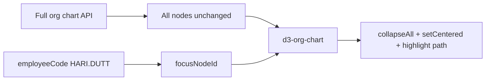

# Fix Org Role Mapping + Org Chart Focus

## Overview

Two related fixes: (1) correct Cognitensor `usertype`-driven roles for VIVEK, HARI.DUTT, SACHIN.ZHRAJGUJMP, and (2) org chart opens **focused on the logged-in user's card** without removing any nodes from the tree.

---

## Part A — Org chart focus (HARI.DUTT and all managers)

### User requirement

When logged in as `HARI.DUTT` (or any manager below National Head), opening **Org Chart** should land on **their card** — centered, highlighted, collapsed view starting at them — but the **full hierarchy must remain** in the data. Do **not** trim/subset nodes to only their subtree.

### Current behavior (wrong)

[`app/src/app/(crm)/org-chart/page.tsx`](app/src/app/(crm)/org-chart/page.tsx) calls `subtreeRootedAt()` which filters the node list to the user + descendants only and re-parents the user as root. That **removes** VIVEK and peers above them from the chart.

[`OrgChartView.tsx`](app/src/components/org-chart/OrgChartView.tsx) uses `rootedAtUser` mode with `collapseAll()` on the (already trimmed) data.

### Target behavior

| Do | Don't |
|----|-------|
| Pass **full** `data` from API to `OrgChartView` | Call `subtreeRootedAt()` or filter nodes |
| Resolve `focusNodeId` from `profile.salesTeam.employeeCode` | Re-parent user's `parentId` to `null` |
| On load: `collapseAll()` → `setUpToTheRootHighlighted(id)` → `setCentered(id)` → `fit()` | `expandAll()` on first paint for managers |
| Wait for profile before first render (already done) | Trim cards above/beside the user |

### Implementation steps

1. **[`org-chart/page.tsx`](app/src/app/(crm)/org-chart/page.tsx)** — Remove `subtreeRootedAt` usage; always pass full `data`. Pass `focusNodeId={currentUserNodeId}` for managers (ZH/RH/ASM/DM), not a re-rooted subset.
2. **[`OrgChartView.tsx`](app/src/components/org-chart/OrgChartView.tsx)** — Replace `rootedAtUser` prop with `focusOnLogin` (or single `focusNodeId` behavior):
   - When `focusNodeId` is set: `collapseAll()` → highlight path to root → `setCentered(focusNodeId)` → `fit()` so the user's card fills the viewport.
   - When absent (Super Admin / National Head): `expandAll()` as today.
3. **[`org-chart-utils.ts`](app/src/lib/org-chart-utils.ts)** — Remove or deprecate `subtreeRootedAt`; keep `resolveCurrentUserNodeId` and `shouldRootOrgChartAtUser` (rename to `shouldFocusOrgChartOnLogin` if clearer).
4. **Verify** as `hari.dutt@roinet.in`: full tree still loadable via Expand All; initial view shows **Hari Dutt** card centered, VIVEK still exists above when user expands.

---

## Part B — Role mapping (usertype-driven)

### Root cause

| Pipeline | File | Rule | HARI.DUTT today |
|----------|------|------|-----------------|
| Org graph | [`org-graph-builder.ts`](server/src/common/org-graph/org-graph-builder.ts) | `usertype`, first-seen wins | `ADMIN` |
| User seed | [`sync-from-snapshots.ts`](server/src/seed/sync-from-snapshots.ts) | R-column (R3→ZH) | Sidebar: **Zonal Head** |

Cognitensor snapshot: VIVEK and HARI.DUTT both have `usertype: 0`; SACHIN.ZHRAJGUJMP has `usertype: 14` (SZH) in many districts.

### Target mapping

| UserCode | Org chart label | App `User.role` | Scope |
|----------|-----------------|-----------------|-------|
| `VIVEK` | **Admin** (special case, top of tree) | `NATIONAL_HEAD` | All data |
| `HARI.DUTT` | **National Head** | `NATIONAL_HEAD` | All data |
| `SACHIN.ZHRAJGUJMP` | **Super Zonal Head** | `ZH` | ~132 districts |
| Others | Max `usertype` across all chain slots | `appRoleFromOrgRole` | Org graph |

**VIVEK / HARI.DUTT:** Both usertype `0`; VIVEK stays **Admin** (explicit special case); HARI.DUTT becomes **National Head** when he has an Admin parent in the graph. Both keep national-level data scope.

### Implementation steps

1. **[`user-type.util.ts`](server/src/common/external-api/user-type.util.ts)** — Add org role `NATIONAL_HEAD`, `mergeOrgRole()` (max rank), `refineAdminRoles()` (VIVEK special case + Admin-parent rule), update `ORG_ROLE_TO_APP_ROLE`, add unit tests.
2. **[`org-graph-builder.ts`](server/src/common/org-graph/org-graph-builder.ts)** — Merge usertype across all chain slots per userId; apply `refineAdminRoles`.
3. **[`sync-from-snapshots.ts`](server/src/seed/sync-from-snapshots.ts)** — Replace R-column `extractHierarchyUsers` with shared usertype resolver.
4. **[`sales-team.service.ts`](server/src/modules/sales-team/sales-team.service.ts)** — Remove `LEVEL_TO_DESIGNATION` in `syncFromExternalApi`.
5. **[`OrgChartView.tsx`](app/src/components/org-chart/OrgChartView.tsx)** — Add `NATIONAL_HEAD` to `DESIGNATION_CONFIG`.
6. **Docs + demo aliases** — [`developer-login-matrix.md`](server/docs/developer-login-matrix.md), [`hierarchy-scope.util.ts`](server/src/common/auth/hierarchy-scope.util.ts): HARI.DUTT = National Head; SACHIN = SZH; point `zonal@` demo alias at a true ZH user if needed.
7. **`npm run seed:all`** — Rebuild org graph and fix `@roinet.in` roles.

---

## Verification checklist

- [ ] `hari.dutt@roinet.in` — sidebar **National Head**; org chart card label **National Head**; opens **focused on Hari Dutt card** with full tree still available
- [ ] `vivek@roinet.in` — org chart card **Admin**; national scope
- [ ] `sachin.zhrajgujmp@roinet.in` — org chart card **Super Zonal Head**; scoped districts
- [ ] Expand All after login still shows VIVEK above HARI.DUTT (no trimmed data)

## Todos

- org-chart-focus: Remove subtree trim; center/highlight user card on full tree
- role-resolver: NATIONAL_HEAD org role, merge + Admin split + tests
- org-graph-builder: Max-rank usertype merge
- seed-sync: Usertype-based user seeding in sync-from-snapshots + sales-team sync
- frontend-labels: NATIONAL_HEAD designation in org chart
- docs-aliases: Login matrix + demo alias corrections
- reseed-verify: seed:all + API checks for three key users
