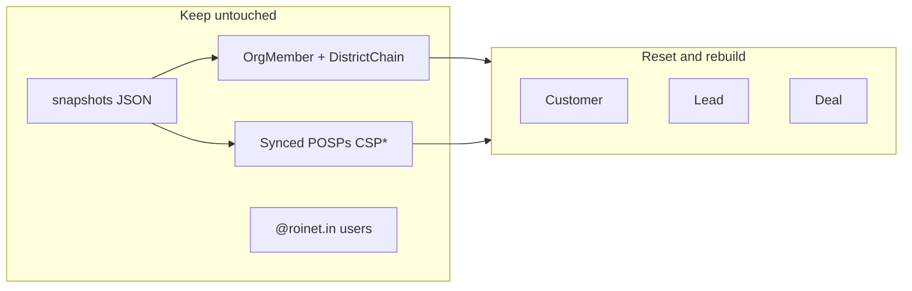

# Fresh CRM Seed + Hierarchy Login Guide

## Problem today

Two seed pipelines exist and they conflict:


| Pipeline         | Command            | What it owns                                                                      |
| ---------------- | ------------------ | --------------------------------------------------------------------------------- |
| Cognitensor root | `npm run seed:all` | POSPs, hierarchy users, org graph (`OrgMember`, `DistrictChain`)                  |
| Demo CRM         | `npm run db:seed`  | Synthetic customers, leads, deals, `POSP-1001`…, expanded `@seed.roinet.com` tree |


Transactional records from `[server/prisma/seed.ts](server/prisma/seed.ts)` use **synthetic** geo (`zone-west`, null `districtId`) while filters resolve to **Cognitensor numeric** `districtId`s via `[GeoCatalogService](server/src/modules/geo/geo-catalog.service.ts)`. Result: scoped users see empty lists even though org chart works.

**Your constraint:** reset app CRM data only; **do not** touch Cognitensor-synced root data.




---

## Implementation

### 1. Trim `db:seed` to demo accounts only

Edit `[server/prisma/seed.ts](server/prisma/seed.ts)` `main()` to run **only**:

- `seedUsers()` — 7 `@roinet.com` demo logins
- `seedSalesTeam()` — 5 `SALES_TEAM_DEFS` rows (with `EMP-`* codes aliased via `[hierarchy-scope.util.ts](server/src/common/auth/hierarchy-scope.util.ts)`)

**Remove from default `db:seed`:**

- `seedCustomers`, `seedDeals`, `seedLeads`, `seedPosp` (synthetic `POSP-1001`)
- `seedExpandedHierarchy()` (~120 synthetic POSPs + `@seed.roinet.com` accounts)
- `backfillDealGeo()` (moves to new CRM seed)

**Link demo POSP account:** in `seedUsers`, after `seed:all` has run, connect `posp@roinet.com` to an existing synced POSP (e.g. `CSP023057` / `shivraj.wanole@roinet.in`) via `user.pospId` instead of creating `POSP-1001`.

### 2. New CRM seed script — `seed:crm`

Add `[server/src/seed/seed-transactional.ts](server/src/seed/seed-transactional.ts)` + npm script:

```json
"seed:crm": "ts-node -r tsconfig-paths/register src/seed/seed-transactional.ts"
```

**Phase 0 — wipe (order respects FKs):**

```sql
DELETE Deal → DELETE Lead → DELETE Customer
```

Do **not** delete `Posp`, `OrgMember`, `DistrictChain`, `SalesTeam` from sync.

**Phase 1 — load reference maps from DB + snapshots:**

- Real POSPs: `prisma.posp` where `externalId IS NOT NULL` and `districtId IS NOT NULL`
- District geo: `districts-sample.json` → `{ districtId → stateId, zoneId, regionId, names }`
- District owners: `DistrictChain` where `chainLevel = 0` → `{ districtId → memberId }` → `OrgMember.userCode` → `SalesTeam.id` for `assignedToId`

**Phase 2 — customers (~80–100):**

- Distribute across districts that have at least one synced POSP (ensures every seeded district is “active”)
- Set `stateId`, `districtId`, `cityId` (city optional/null), plus human-readable names from snapshot
- Synthetic person fields (name, mobile, email) — only geo is real

**Phase 3 — deals (~150–200):**

- Assign each deal to a **synced POSP** (round-robin across POSPs)
- Copy geo from POSP’s `districtId` via district map: `districtId`, `zoneId`, `regionId` (Cognitensor numeric strings)
- Link optional `customerId` from customers in the same district
- Use existing product/status rotation from `[seed-generators.ts](server/prisma/seed-generators.ts)`

**Phase 4 — leads (~80–100):**

- Link `customerId` + `assignedToId` (DM `SalesTeam` for that district, from district owner map)
- Set `zoneId`, `regionId`, `districtId` from customer’s district (mirror deal geo pattern — leads currently have **no** backfill in `[seed.ts](server/prisma/seed.ts)`)

**Phase 5 — verify counts per scoped subtree**

Log a summary: customers/deals/leads per sample district for `HARI.DUTT`, `MUNDHE.ASMMAHA`, `CSP023057` territories.

### 3. Shared geo helper

Add a small helper (in seed script or `[server/src/seed/geo-seed.util.ts](server/src/seed/geo-seed.util.ts)`):

```ts
function geoForDistrict(districtId: string, districtMap: Map<string, DistrictRow>): GeoFields
```

Used by customers, deals, and leads — avoids duplicating the backfill logic currently in `backfillDealGeo()`.

### 4. Document workflow + login matrix

Update `[server/docs/authentication-roles-and-scope.md](server/docs/authentication-roles-and-scope.md)` with:

**Local setup order (after VPN for snapshot refresh):**

```bash
cd server
npm run snapshots:refresh   # optional: refresh Cognitensor JSON
npm run seed:all            # org graph + POSPs (root — run once / weekly)
npm run db:seed             # demo @roinet.com accounts only
npm run seed:crm            # fresh customers / leads / deals
```

**Login matrix — use these to test each level:**


| Level                | Email                         | Password            | Scope                                           | What to check                      |                     |
| -------------------- | ----------------------------- | ------------------- | ----------------------------------------------- | ---------------------------------- | ------------------- |
| Super Admin          | `superadmin@roinet.com`       | `Admin@1234`        | All data                                        | Full lists, all filters, org chart |                     |
| National Head        | `national@roinet.com`         | `National@123`      | All data                                        | Same as above                      |                     |
| National Head (real) | `vivek@roinet.in`             | `VIVEK`             |                                                 | All data                           | Real synced account |
| Zonal Head           | `zonal@roinet.com`            | `Zonal@1234`        | ~561 districts (aliased to `HARI.DUTT`)         | Dashboard + lists scoped to zone   |                     |
| Zonal Head (real)    | `hari.dutt@roinet.in`         | `HARI.DUTT`         | ~561 districts                                  | Preferred for realistic testing    |                     |
| Regional Head        | `regional@roinet.com`         | `Regional@123`      | ~132 districts (aliased to `SACHIN.ZHRAJGUJMP`) | Smaller subtree                    |                     |
| Regional Head (real) | `sachin.zhrajgujmp@roinet.in` | `SACHIN.ZHRAJGUJMP` | ~132 districts                                  |                                    |                     |
| ASM                  | `asm@roinet.com`              | `Asm@12345`         | ~38 districts (aliased to `SHAIKH.RHMAHA`)      |                                    |                     |
| ASM (real)           | `shaikh.rhmaha@roinet.in`     | `SHAIKH.RHMAHA`     | ~38 districts                                   |                                    |                     |
| DM                   | `dm@roinet.com`               | `Dm@123456`         | ~13 districts (aliased to `MUNDHE.ASMMAHA`)     |                                    |                     |
| DM (real)            | `mundhe.asmma@roinet.in`      | `MUNDHE.ASMMAHA`    | ~13 districts                                   | Smallest manager scope             |                     |
| POSP                 | `posp@roinet.com`             | `Posp@1234`         | Self only (linked to real CSP)                  | Own deals/leads only               |                     |
| POSP (real)          | `shivraj.wanole@roinet.in`    | `CSP023057`         | Self only (district 330)                        | Real POSP account                  |                     |


**Notes for testers:**

- Password for all `@roinet.in` synced accounts = their `UserCode` (case-sensitive)
- Org chart page uses DB graph (not live API per request)
- Geo filters (zone/region/state/district) resolve to Cognitensor `districtId`s — seeded CRM data will use those IDs
- `@seed.roinet.com` accounts will no longer be created (they had empty scope)

### 5. Verification checklist

After `seed:crm`:

1. Login as `hari.dutt@roinet.in` → customers/deals/leads lists non-empty; geo filter by zone returns subset
2. Login as `mundhe.asmma@roinet.in` → smaller counts than ZH; org chart scoped
3. Login as `shivraj.wanole@roinet.in` → only own POSP deals
4. Dashboard stats non-zero for each scoped role
5. `superadmin@` sees superset of all scoped views

---

## Files to change


| File                                                                                             | Change                                                  |
| ------------------------------------------------------------------------------------------------ | ------------------------------------------------------- |
| `[server/prisma/seed.ts](server/prisma/seed.ts)`                                                 | Demo users + sales team only; link `posp@` to real POSP |
| `[server/src/seed/seed-transactional.ts](server/src/seed/seed-transactional.ts)`                 | **New** — wipe + rebuild CRM with real geo              |
| `[server/src/seed/geo-seed.util.ts](server/src/seed/geo-seed.util.ts)`                           | **New** — district → geo field helper                   |
| `[server/package.json](server/package.json)`                                                     | Add `seed:crm` script                                   |
| `[server/docs/authentication-roles-and-scope.md](server/docs/authentication-roles-and-scope.md)` | Login matrix + setup workflow                           |


No schema migrations required.