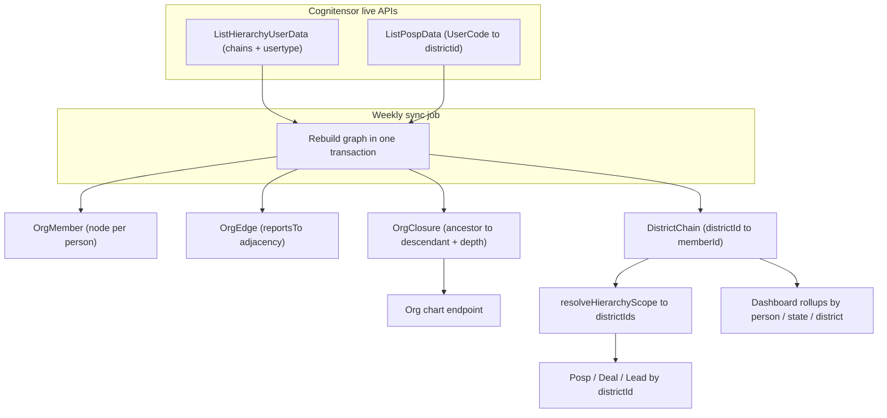

# Org Graph Architecture

## The core problem

`ListHierarchyUserData` returns, per district, a district owner plus a variable-length upline chain `R1..R7`. The crucial facts from [myownthinking.md](myownthinking.md) and [api-responses/user-type.txt](api-responses/user-type.txt):

- Role is defined by `usertype`, NOT column position. `HARI.DUTT` (usertype `0` = ADMIN) appears at `R3` in one district and `R4` in another.
- Depth varies per district (some chains are 4 deep, some 6).
- POSPs are NOT in this API; they attach to the graph only through `districtid` (from [api-responses/list-posp-data.json](api-responses/list-posp-data.json)).
- Business (leads/deals) is done by POSPs; every manager in a district's chain "owns" that district's business transitively.

The current [server/prisma/schema.prisma](server/prisma/schema.prisma) `DistrictHierarchy` model hardcodes `dmCode/asmCode/rhCode/zhCode/nhCode` — one fixed role per column. This directly contradicts the variable-depth, usertype-driven reality, so it must be replaced.

## Recommended model: node + edge + closure + district bridge

New tables (replacing `DistrictHierarchy`):

- `OrgMember` - one row per distinct person. Key fields: `userId` (Cognitensor, unique), `userCode`, `userName`, `userType` (int), `role` (derived label). Source of truth for "who exists" + their role.
- `OrgEdge` - deduped `memberId -> managerId` (reportsTo). Built from each chain: owner->R1, R1->R2, ... A person reporting to the same manager across many districts collapses to one edge.
- `OrgClosure` - `ancestorId`, `descendantId`, `depth` (0 = self). Transitive closure of `OrgEdge`. Gives O(1)-ish "everyone under X" and renders the org chart without recursion.
- `DistrictChain` - `districtId`, `memberId`, `chainLevel`. Every member that covers a district (owner + all R-levels). This is the bridge from the people-graph to geography/business. Indexed on `memberId` and `districtId`.

Why closure table over recursive CTE: your goals are "business data in milliseconds" and a rendered org chart. Closure makes subtree + rollup pure indexed lookups; it is rebuilt weekly (read-heavy, write-rare) so the storage cost is justified. SQL Server recursive CTEs would re-walk the tree on every dashboard hit.

## Role derivation

Map `usertype` to a label using [api-responses/user-type.txt](api-responses/user-type.txt): `0 ADMIN, 1 CMF, 2 CSF, 3 CSP, 4 ASM, 6 RH, 10 ZH, 11 ASSISTASM, 12 CH, 14 SZH`. Note these do NOT match the app auth `Role` enum (`SUPER_ADMIN|NATIONAL_HEAD|ZH|RH|ASM|DM|POSP`) - new roles `CH`, `ASSISTASM`, `SZH`, `CMF`, `CSF` exist. Keep the org-graph `role` label separate from the auth `Role`; the dashboard/org-chart uses the org label, login/RBAC keeps the auth role. A small mapping table/util resolves one to the other.

## Scope resolution (minimal change, big win)

The existing `HierarchyScope { districtIds }` shape and `buildDealScopeWhere` / `buildPospScopeWhere` / `buildLeadScopeWhere` in [server/src/common/auth/hierarchy-scope.util.ts](server/src/common/auth/hierarchy-scope.util.ts) stay as-is - they already filter `Posp/Deal/Lead.districtId`. Only the resolver changes:

- Today: `resolveHierarchyScope` maps role -> fixed column -> `DistrictHierarchy` rows.
- New: look up the logged-in person in `OrgMember` (by userCode/userId from the SSO token), then `DistrictChain.findMany({ where: { memberId } })` -> `districtIds`. SUPER_ADMIN/NATIONAL_HEAD stay unrestricted; POSP stays `{ pospIds: [self] }`.

Because `DistrictChain` lists a member against every district they cover transitively, no closure walk is needed for scoping - it is a single indexed query.

## Sync / cron

- Add `@nestjs/schedule`; a weekly `OrgSyncService` calls `listHierarchyLive()` ([server/src/common/external-api/external-api.service.ts](server/src/common/external-api/external-api.service.ts)) + POSP sync, then rebuilds `OrgMember/OrgEdge/OrgClosure/DistrictChain` inside one `prisma.$transaction` (truncate + reinsert, or diff-upsert). Manual trigger endpoint for admins.
- Closure build: after edges are written, expand transitively in code (chains are shallow, <8 levels) and bulk-insert closure rows.

## Migration impact (files to change)

- [server/prisma/schema.prisma](server/prisma/schema.prisma): drop `DistrictHierarchy`, add `OrgMember`, `OrgEdge`, `OrgClosure`, `DistrictChain` (+ migration).
- [server/src/common/auth/hierarchy-scope.util.ts](server/src/common/auth/hierarchy-scope.util.ts): rewrite `resolveHierarchyScope` + `districtIdsForCode` to use `DistrictChain`/`OrgMember`; keep the `build*ScopeWhere` helpers.
- [server/src/modules/hierarchy/hierarchy.service.ts](server/src/modules/hierarchy/hierarchy.service.ts): replace the fixed `LEVELS` / column logic with `OrgClosure` traversal for filter-options, subordinates, and a new org-chart query.
- [server/src/modules/sales-team/sales-team.service.ts](server/src/modules/sales-team/sales-team.service.ts) and [server/src/seed/sync-from-snapshots.ts](server/src/seed/sync-from-snapshots.ts): point hierarchy sync at the new graph builder; `SalesTeam.managerId` tree is no longer the scoping source (keep only if still needed for internal CRM users).
- External API: extend the `ExternalHierarchyUser` type with the new `usertype` / `R6` / `R7` fields ([server/src/common/external-api/external-api.types.ts](server/src/common/external-api/external-api.types.ts)).
- Dashboard ([server/src/modules/dashboard/dashboard.repository.ts](server/src/modules/dashboard/dashboard.repository.ts)): rollups join `DistrictChain` -> `Posp.districtId` -> deals/leads; geography filters use state/district/city ids.

## Open considerations

- Geography: states/districts/cities are currently read from snapshots. Optional follow-up is dedicated `GeoState/GeoDistrict/GeoCity` tables for joinable dashboard filters.
- A person can appear as a district owner in some rows and an upline in others - `OrgMember` keyed by `userId` dedupes this; `DistrictChain.chainLevel` records position per district.