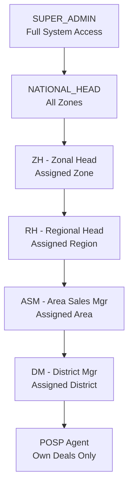
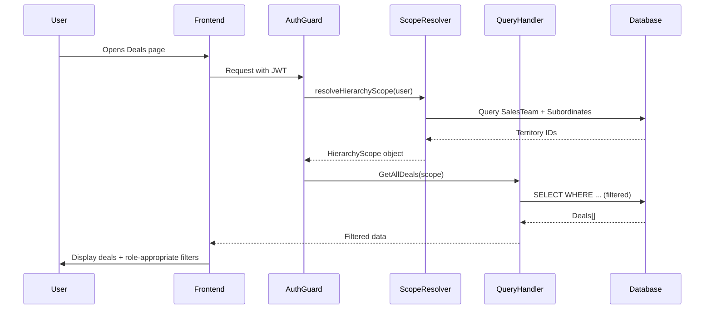

# Multi-Level Insurance Platform: Role-Based Access & Universal Filtering System

## Executive Summary

This plan establishes a **hierarchical data access system** where each role sees only data within their organizational scope, with progressively broader visibility at higher levels. A **universal filter component** adapts based on user role, showing relevant dimensions for insurance metrics.

## Role Hierarchy & Data Visibility




### Data Scope by Role


| Role              | Deals Visible                   | POSPs Visible                | Leads Visible         | Customers Visible          | Can Create For                      |
| ----------------- | ------------------------------- | ---------------------------- | --------------------- | -------------------------- | ----------------------------------- |
| **SUPER_ADMIN**   | All deals                       | All POSPs                    | All leads             | All customers              | Anyone                              |
| **NATIONAL_HEAD** | All deals                       | All POSPs                    | All leads             | All customers              | Anyone (read-only on system config) |
| **ZH**            | All deals in assigned zone(s)   | POSPs under zone hierarchy   | Leads in zone         | Customers in zone          | Subordinates only                   |
| **RH**            | All deals in assigned region(s) | POSPs under region hierarchy | Leads in region       | Customers in region        | Subordinates only                   |
| **ASM**           | All deals for managed POSPs     | Managed POSPs only           | Leads assigned to ASM | Customers of managed POSPs | Managed POSPs only                  |
| **DM**            | All deals for district POSPs    | District POSPs only          | Leads in district     | Customers in district      | District POSPs only                 |
| **POSP**          | Own deals only                  | Self only                    | Own leads only        | Own customers only         | Self only                           |


## System Architecture

### 1. Database Schema Enhancements

**Add to [server/prisma/schema.prisma](server/prisma/schema.prisma)**:

```prisma
model SalesTeam {
  // ... existing fields
  
  // NEW: Explicit territory assignments
  zoneId       String?  @db.NVarChar(50)
  zoneName     String?  @db.NVarChar(100)
  regionId     String?  @db.NVarChar(50)
  regionName   String?  @db.NVarChar(100)
  areaId       String?  @db.NVarChar(50)
  areaName     String?  @db.NVarChar(100)
  districtId   String?  @db.NVarChar(50)
  districtName String?  @db.NVarChar(100)
}

model Posp {
  // ... existing fields
  
  // NEW: Link POSP to sales hierarchy for filtering
  dmId         String?  @db.NVarChar(36)
  dm           SalesTeam? @relation("DMManaged", fields: [dmId], references: [id])
  
  zoneId       String?  @db.NVarChar(50)
  regionId     String?  @db.NVarChar(50)
  areaId       String?  @db.NVarChar(50)
  districtId   String?  @db.NVarChar(50)
}

model Deal {
  // ... existing fields
  
  // NEW: Denormalized hierarchy for fast filtering
  zoneId       String?  @db.NVarChar(50)
  regionId     String?  @db.NVarChar(50)
  areaId       String?  @db.NVarChar(50)
  districtId   String?  @db.NVarChar(50)
}

model Lead {
  // ... existing fields
  
  // NEW: Hierarchy context
  zoneId       String?  @db.NVarChar(50)
  regionId     String?  @db.NVarChar(50)
  areaId       String?  @db.NVarChar(50)
  districtId   String?  @db.NVarChar(50)
}
```

### 2. Backend: Hierarchical Scope Resolution

**Create [server/src/common/auth/hierarchy-scope.util.ts](server/src/common/auth/hierarchy-scope.util.ts)**:

```typescript
export interface HierarchyScope {
  zoneIds?: string[];
  regionIds?: string[];
  areaIds?: string[];
  districtIds?: string[];
  pospIds?: string[];
}

export async function resolveHierarchyScope(
  user: AuthUser,
  prisma: PrismaService
): Promise<HierarchyScope> {
  const role = user.role;
  
  if (role === 'SUPER_ADMIN' || role === 'NATIONAL_HEAD') {
    return {}; // Empty = all data
  }
  
  // Find user's SalesTeam record
  const salesTeam = await prisma.salesTeam.findUnique({
    where: { userId: user.id }
  });
  
  if (!salesTeam) return { pospIds: [] }; // No access
  
  switch (role) {
    case 'ZH':
      return {
        zoneIds: salesTeam.zoneId ? [salesTeam.zoneId] : []
      };
    case 'RH':
      return {
        regionIds: salesTeam.regionId ? [salesTeam.regionId] : []
      };
    case 'ASM':
      // Get all POSPs managed by this ASM
      const posps = await prisma.posp.findMany({
        where: { asmId: salesTeam.id },
        select: { id: true }
      });
      return {
        pospIds: posps.map(p => p.id)
      };
    case 'DM':
      // Get POSPs in this DM's district
      const districtPosps = await prisma.posp.findMany({
        where: { districtId: salesTeam.districtId },
        select: { id: true }
      });
      return {
        pospIds: districtPosps.map(p => p.id)
      };
    case 'POSP':
      return {
        pospIds: user.pospId ? [user.pospId] : []
      };
    default:
      return { pospIds: [] };
  }
}
```

**Update [server/src/modules/deal/queries/get-all-deals.handler.ts](server/src/modules/deal/queries/get-all-deals.handler.ts)**:

```typescript
async execute(query: GetAllDealsQuery): Promise<Deal[]> {
  const scope = query.hierarchyScope;
  
  if (!scope || Object.keys(scope).length === 0) {
    // Super admin / National head: all deals
    return this.dealRepo.findAll();
  }
  
  // Build Prisma where clause
  const where: any = {};
  
  if (scope.pospIds) {
    where.pospId = { in: scope.pospIds };
  } else if (scope.zoneIds) {
    where.zoneId = { in: scope.zoneIds };
  } else if (scope.regionIds) {
    where.regionId = { in: scope.regionIds };
  } else if (scope.areaIds) {
    where.areaId = { in: scope.areaIds };
  } else if (scope.districtIds) {
    where.districtId = { in: scope.districtIds };
  }
  
  return this.dealRepo.findByScope(where);
}
```

### 3. Universal Filter Component (Frontend)

**Create [app/src/components/filters/UniversalFilter.tsx](app/src/components/filters/UniversalFilter.tsx)**:

```typescript
interface FilterDimension {
  key: string;
  label: string;
  options: { value: string; label: string }[];
  visible: boolean;
}

interface UniversalFilterProps {
  userRole: Role;
  onFilterChange: (filters: FilterState) => void;
}

export function UniversalFilter({ userRole, onFilterChange }: UniversalFilterProps) {
  // Define which dimensions each role can filter by
  const dimensions: FilterDimension[] = [
    {
      key: 'dateRange',
      label: 'Date Range',
      options: [
        { value: 'today', label: 'Today' },
        { value: 'week', label: 'This Week' },
        { value: 'month', label: 'This Month' },
        { value: 'quarter', label: 'This Quarter' },
        { value: 'year', label: 'This Year' },
        { value: 'custom', label: 'Custom' }
      ],
      visible: true // All roles
    },
    {
      key: 'zone',
      label: 'Zone',
      options: [], // Fetched from API
      visible: ['SUPER_ADMIN', 'NATIONAL_HEAD'].includes(userRole)
    },
    {
      key: 'region',
      label: 'Region',
      options: [],
      visible: ['SUPER_ADMIN', 'NATIONAL_HEAD', 'ZH'].includes(userRole)
    },
    {
      key: 'area',
      label: 'Area',
      options: [],
      visible: ['SUPER_ADMIN', 'NATIONAL_HEAD', 'ZH', 'RH'].includes(userRole)
    },
    {
      key: 'district',
      label: 'District',
      options: [],
      visible: ['SUPER_ADMIN', 'NATIONAL_HEAD', 'ZH', 'RH', 'ASM'].includes(userRole)
    },
    {
      key: 'posp',
      label: 'POSP',
      options: [],
      visible: userRole !== 'POSP' // All except POSP
    },
    {
      key: 'product',
      label: 'Product',
      options: [
        { value: 'LIFE', label: 'Life Insurance' },
        { value: 'HEALTH', label: 'Health Insurance' },
        { value: 'MOTOR', label: 'Motor Insurance' }
      ],
      visible: true
    },
    {
      key: 'status',
      label: 'Status',
      options: [
        { value: 'H', label: 'Hot' },
        { value: 'W', label: 'Warm' },
        { value: 'C', label: 'Cold' }
      ],
      visible: true
    },
    {
      key: 'premiumRange',
      label: 'Premium Range',
      options: [
        { value: '0-10000', label: '₹0 - ₹10K' },
        { value: '10000-25000', label: '₹10K - ₹25K' },
        { value: '25000-50000', label: '₹25K - ₹50K' },
        { value: '50000-100000', label: '₹50K - ₹1L' },
        { value: '100000+', label: '₹1L+' }
      ],
      visible: true
    },
    {
      key: 'issued',
      label: 'Policy Status',
      options: [
        { value: 'issued', label: 'Issued' },
        { value: 'pending', label: 'Pending' }
      ],
      visible: true
    }
  ];
  
  // Render only visible dimensions
  return (
    <div className="universal-filter">
      {dimensions.filter(d => d.visible).map(dimension => (
        <FilterDropdown
          key={dimension.key}
          label={dimension.label}
          options={dimension.options}
          onChange={(value) => handleDimensionChange(dimension.key, value)}
        />
      ))}
    </div>
  );
}
```

### 4. Insurance-Specific Filter Dimensions

**Key Metrics for Multi-Level Insurance Platform**:

1. **Temporal Filters**
  - Date range (Today / Week / Month / Quarter / Year / Custom)
  - Policy issue date range
  - Renewal date range (for tracking upcoming renewals)
2. **Geographical Hierarchy**
  - Zone (visible to: SUPER_ADMIN, NATIONAL_HEAD)
  - Region (visible to: SUPER_ADMIN, NATIONAL_HEAD, ZH)
  - Area (visible to: SUPER_ADMIN, NATIONAL_HEAD, ZH, RH)
  - District (visible to: SUPER_ADMIN, NATIONAL_HEAD, ZH, RH, ASM)
  - State / City (all roles)
3. **Sales Hierarchy**
  - POSP (all management roles)
  - ASM (RH and above)
  - DM (ASM and above)
  - RH (ZH and above)
  - ZH (NATIONAL_HEAD and SUPER_ADMIN)
4. **Product Dimensions**
  - Product type (Life / Health / Motor)
  - Policy category (Term / Endowment / ULIP / Mediclaim / Comprehensive)
  - Insurer/Company
5. **Deal Metrics**
  - Deal status (Hot / Warm / Cold)
  - Premium range buckets
  - Sum assured range
  - Margin range
  - COA (Commission on Acquisition) range
6. **Customer Segments**
  - KYC status (Pending / Verified / Rejected)
  - Source (Walk-in / Referral / Online / Tele-sales)
  - Age brackets
  - New vs Renewal customers
7. **Performance Metrics**
  - Conversion rate threshold
  - Policy issuance status (Issued / Pending / Rejected)
  - Payment status

## Implementation Flow




## Page-Level Access Control

### Dashboard

- **SUPER_ADMIN / NATIONAL_HEAD**: System-wide KPIs, all zones aggregated
- **ZH**: Zone KPIs (all regions under zone)
- **RH**: Region KPIs (all areas under region)
- **ASM**: Area KPIs (managed POSPs only)
- **DM**: District KPIs (district POSPs only)
- **POSP**: Personal KPIs (own deals, premium, commission)

### Deals Tracker

- Each role sees only deals within their scope
- Universal filter adapts: ZH+ can filter by geography, ASM+ can filter by POSP
- POSP sees only their own deals (no filters except date/product)

### POSP Roster

- **SUPER_ADMIN / NATIONAL_HEAD**: All POSPs
- **ZH**: All POSPs in assigned zone
- **RH**: All POSPs in assigned region
- **ASM**: Only managed POSPs
- **DM**: POSPs in district
- **POSP**: Self only (view-only profile)

### Leads Pipeline

- Each role sees leads within their scope
- ASM+ can reassign leads to subordinate POSPs
- POSP can only create/edit own leads

### Reports

- All reports auto-filter by hierarchy scope
- Export CSV respects role-based filtering
- Commission reports: ASM+ see subordinates, POSP sees self

## Files to Create/Modify

### Backend (NestJS)

1. **[server/src/common/auth/hierarchy-scope.util.ts](server/src/common/auth/hierarchy-scope.util.ts)** (new)
  - `resolveHierarchyScope(user, prisma): Promise<HierarchyScope>`
  - `buildScopeWhereClause(scope): Prisma.WhereInput`
2. **[server/src/common/decorators/scope.decorator.ts](server/src/common/decorators/scope.decorator.ts)** (new)
  - `@ApplyHierarchyScope()` decorator to auto-inject scope into requests
3. **[server/src/modules/deal/queries/get-all-deals.query.ts](server/src/modules/deal/queries/get-all-deals.query.ts)** (update)
  - Add `hierarchyScope: HierarchyScope` parameter
4. **[server/src/modules/deal/deal.repository.ts](server/src/modules/deal/deal.repository.ts)** (update)
  - Add `findByScope(where): Promise<Deal[]>`
5. **[server/src/modules/posp/posp.repository.ts](server/src/modules/posp/posp.repository.ts)** (update)
  - Add `findByScope(where): Promise<Posp[]>`
6. **[server/src/modules/lead/lead.repository.ts](server/src/modules/lead/lead.repository.ts)** (update)
  - Add `findByScope(where): Promise<Lead[]>`
7. **[server/prisma/schema.prisma](server/prisma/schema.prisma)** (update)
  - Add geography/hierarchy fields to `SalesTeam`, `Posp`, `Deal`, `Lead`
8. **Migration script**: Backfill existing records with zone/region/area/district IDs from POSP's ASM relationship

### Frontend (Next.js)

1. **[app/src/components/filters/UniversalFilter.tsx](app/src/components/filters/UniversalFilter.tsx)** (new)
  - Role-aware filter component
2. **[app/src/hooks/useFilterState.ts](app/src/hooks/useFilterState.ts)** (new)
  - Centralized filter state management
3. **[app/src/lib/filter-utils.ts](app/src/lib/filter-utils.ts)** (new)
  - `getVisibleDimensions(role): FilterDimension[]`
    - `applyFiltersToData(data, filters): filtered data`
4. **[app/src/app/(crm)/dashboard/page.tsx](app/src/app/(crm)/dashboard/page.tsx)** (update)
  - Add `<UniversalFilter>` above KPI cards
5. **[app/src/app/(crm)/deals/page.tsx](app/src/app/(crm)/deals/page.tsx)** (update)
  - Replace simple FilterChips with `<UniversalFilter>`
6. **[app/src/providers/auth-provider.tsx](app/src/providers/auth-provider.tsx)** (update)
  - Expose `user.role` to components

## Migration Strategy

**Phase 1: Schema (Week 1)**

- Add geography columns to Prisma schema
- Generate migration, run on dev database
- Backfill script: assign zone/region/area/district to existing records based on POSP→ASM→SalesTeam chain

**Phase 2: Backend (Week 2)**

- Implement `hierarchy-scope.util.ts`
- Update all query handlers to accept `HierarchyScope`
- Update repositories with scope-aware queries
- Add integration tests for each role's data visibility

**Phase 3: Frontend (Week 3)**

- Build `UniversalFilter` component
- Update all pages to use universal filter
- Add filter presets for common views
- Test with different role accounts

**Phase 4: Testing & Rollout (Week 4)**

- End-to-end testing with 7 different role accounts
- Performance testing with large datasets (100K+ deals)
- Security audit: ensure no role can access out-of-scope data
- Staged rollout: POSP first, then management roles

## Security Considerations

1. **Never trust frontend filters** — always enforce scope on backend
2. **Row-level security** — every query MUST include hierarchy scope
3. **Audit logging** — log who accessed what data (for compliance)
4. **API rate limiting** — per role (POSP: 100 req/min, ASM+: 1000 req/min)
5. **Data masking** — PII (PAN, Aadhar) visible only to ASM+ roles

