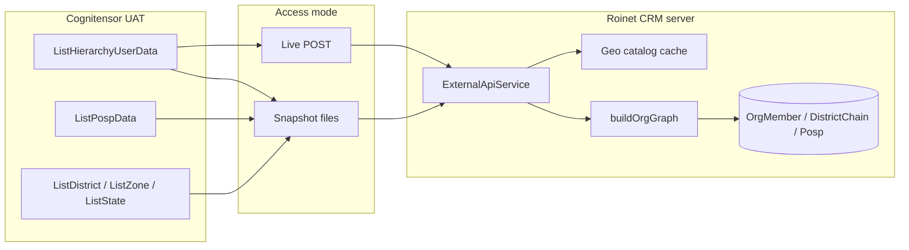

# Cognitensor External API Reference

Roinet CRM reads org structure, geography, and POSP master data from the **Cognitensor** service hosted on Roinet's UAT API. This document describes the upstream API, how we proxy it, and how that data flows into the org graph and CRM.

**Related docs**

- [CRM API catalog](../../api-endpoints/README.md) — our NestJS routes (`/api/external/*`, `/api/geo/*`, etc.)
- [Sample responses](../../responses/README.md) — captured JSON from the local proxy
- [Authentication & scope](./authentication-roles-and-scope.md) — how hierarchy scope is enforced after sync

---

## Upstream base URL

| Environment | Base URL |
|-------------|----------|
| UAT (live) | `https://uatserviceapi.roinet.in` |

All Cognitensor routes are **POST** with `Content-Type: application/json`. There is no API key in our integration — access is network-restricted (VPN / UAT allow-list).

Implementation: [`server/src/common/external-api/external-api.service.ts`](../src/common/external-api/external-api.service.ts)

---

## Response wrapper

Every endpoint returns the same envelope:

```json
{
  "description": "…",
  "Data": [ /* array of row objects */ ]
}
```

TypeScript: `CognitensorResponse<T>` in [`external-api.types.ts`](../src/common/external-api/external-api.types.ts).

---

## Endpoints

| Cognitensor path | Purpose | Request body | Snapshot file |
|------------------|---------|--------------|---------------|
| `POST /Cognitensor/ListState` | Indian states | _(empty)_ | `data/snapshots/states.json` |
| `POST /Cognitensor/ListZone` | Sales zones | _(empty)_ | `data/snapshots/zones.json` |
| `POST /Cognitensor/ListDistrict` | Districts for a state | `{ "stateid": "<StateId>" }` | `data/snapshots/districts-sample.json` |
| `POST /Cognitensor/ListCity` | Cities for a district | `{ "districtid": "<DistrictId>" }` | `data/snapshots/cities-sample.json` |
| `POST /Cognitensor/ListHierarchyUserData` | Per-district manager chain | See below | `data/snapshots/hierarchy.json` |
| `POST /Cognitensor/ListPospData` | POSP roster | See below | `data/snapshots/posps.json` |

POSP rows include `username` (display name) and `UserCode` (login / agent code).

### ListDistrict

`stateid` is required — an empty body errors on the live API. Our refresh script iterates all states and merges districts into one file.

District rows include zone/region when the API provides them:

```json
{
  "StateId": "12",
  "DistrictId": "95",
  "DistrictName": "PATNA",
  "regionid": "2",
  "regionname": "Bihar",
  "zoneid": "6",
  "zonename": "Bihar/JHND"
}
```

### ListHierarchyUserData

One row per **district**. Each row is a vertical chain from district owner up to national level.

| Field | Meaning |
|-------|---------|
| `DistrictId`, `DistrictName` | District key |
| `DistrictManagerId`, `DistrictManagerCode`, `DistrictManagerName` | Front-line district owner (CSP tier) |
| `usertype` | Role of the district manager |
| `R1_*` … `R7_*` | Upline managers (`UserId`, `UserCode`, `UserName`, `R{n}_usertype`) |

Optional filters (live API body):

```json
{
  "DistrictId": null,
  "UserCode": null,
  "UserId": null
}
```

**Important:** A person's **role comes from `usertype`**, not from which R-column they sit in. The same `UserCode` can appear at different R-levels in different districts. Our org graph merges all chain slots per person and keeps the **highest rank** `usertype`, then applies the Admin / National Head split (VIVEK vs HARI.DUTT). See [`user-type.util.ts`](../src/common/external-api/user-type.util.ts).

### ListPospData

**System of record for POSPs.** The CRM never creates POSP master rows manually —
no manager, admin, or agent registers POSPs in the app. New agents appear only
after Cognitensor onboarding and `seed:all` / snapshot refresh. See
[`.cursor/rules/posp-master-data.mdc`](../../.cursor/rules/posp-master-data.mdc).

POSP geography is ID-based (`districtid`, `stateid`, `cityid`).

Optional filters (live API body):

```json
{
  "UserId": null,
  "UserCode": null,
  "stateid": null,
  "districtid": null,
  "cityid": null
}
```

Row shape:

```json
{
  "UserId": "85687",
  "UserCode": "CSP023057",
  "username": "SHIVRAJ GANGADHARRAO WANOLE",
  "MobileNo": "7350357007",
  "EmailId": "shivraj.wanole@roinet.in",
  "districtid": "330",
  "stateid": "26",
  "cityid": "3828",
  "HephGcdCode": "GIDROINET2000473",
  "CreatedDate": "25-08-2025 12:04:26",
  "CreatedBy": "CSP023057"
}
```

`username` is the POSP's display name. Our DB stores it in `Posp.name`; `UserCode` maps to `Posp.code`. UI labels use `Name (UserCode)` when both differ.

---

## `usertype` → org role

Cognitensor `usertype` integers map to org labels (not R-column position):

| `usertype` | Org label | App auth role (approx.) |
|------------|-----------|-------------------------|
| `0` | Admin *(VIVEK special case)* or National Head *(below Admin)* | `NATIONAL_HEAD` |
| `1` | CMF | `DM` |
| `2` | CSF | `DM` |
| `3` | CSP | `DM` |
| `4` | Area Sales Manager | `ASM` |
| `6` | Regional Head | `RH` |
| `10` | Zonal Head | `ZH` |
| `11` | Assistant Area Sales Manager | `ASM` |
| `12` | Cluster Head | `RH` |
| `14` | Super Zonal Head | `ZH` |

Resolver: [`user-type.util.ts`](../src/common/external-api/user-type.util.ts) (`mergeOrgRole`, `refineAdminRoles`).

---

## How the CRM uses this data



| Consumer | Source | Notes |
|----------|--------|-------|
| Org graph (`OrgMember`, `OrgEdge`, `DistrictChain`) | `ListHierarchyUserData` | Built by `buildOrgGraph` — same logic in seed and runtime sync |
| POSP roster + SSO lookup | `ListPospData` | Synced to `Posp` table; `getPospByUserCode` for SSO |
| Geo filters / dashboard scope | Districts + zones + states | Cached in `GeoCatalogService`; large city/district lists are searched server-side |
| `@roinet.in` hierarchy logins | `ListHierarchyUserData` via `seed:all` | Email derived from `UserCode` (upstream has no email); password = `UserCode`. See [UserCode Identity & Login Mapping](./usercode-identity-and-login.md). |

---

## Snapshot mode vs live mode

| Setting | Default | Behaviour |
|---------|---------|-----------|
| `USE_EXTERNAL_API_SNAPSHOT` | `true` | Read bundled JSON under `server/data/snapshots/` |
| `USE_EXTERNAL_API_SNAPSHOT=false` | — | POST to `uatserviceapi.roinet.in` (needs VPN) |

| Environment | Typical mode |
|-------------|--------------|
| Local dev | Snapshot (`true`) |
| AWS ECS prod | Snapshot (`true`) — Fargate has no VPN to UAT |

ECS task definition sets `USE_EXTERNAL_API_SNAPSHOT=true` in Terraform ([`infra/modules/ecs/main.tf`](../../infra/modules/ecs/main.tf)).

**Refresh committed snapshots** (developer machine with VPN):

```bash
cd server
npm run snapshots:refresh
# or: node scripts/refresh-snapshots.mjs
```

Writes: `hierarchy.json`, `zones.json`, `states.json`, `districts-sample.json`, `posps.json`.

**Sync from local `api-responses/` dumps** (no VPN — uses gitignored JSON captures):

```bash
cd server
npm run snapshots:sync-api-responses
# or: node scripts/sync-snapshots-from-api-responses.mjs
```

See [`api-responses/README.md`](../../api-responses/README.md). District zone/region and POSP `username` are merged from existing snapshots when the dump omits them; run `snapshots:refresh` afterward for full enrichment.

---

## CRM proxy routes (`/api/external`)

Our NestJS app exposes read-only GET proxies (JWT required). These call snapshot or live helpers internally.

| GET path | Min role | Upstream |
|----------|----------|----------|
| `/api/external/states` | POSP+ | `ListState` |
| `/api/external/zones` | POSP+ | `ListZone` |
| `/api/external/districts?stateId=` | POSP+ | `ListDistrict` |
| `/api/external/cities?districtId=` | POSP+ | `ListCity` |
| `/api/external/hierarchy` | RH+ | `ListHierarchyUserData` |
| `/api/external/posps` | ASM+ | `ListPospData` (paginated) |

Controller: [`external-api.controller.ts`](../src/common/external-api/external-api.controller.ts).

**Sample proxy responses:** [`responses/external-*.json`](../../responses/).

---

## Seeding & org sync

| Command / route | What it does |
|-----------------|--------------|
| `npm run seed:all` | POSPs + hierarchy users + org graph from snapshots |
| `npm run db:seed` | Demo `@roinet.com` accounts only |
| `POST /api/org-sync/rebuild` | Rebuild org graph from live or snapshot hierarchy (ZH+) |
| `POST /api/sales-team/sync` | Full sales-team sync + org rebuild (ZH+) |
| ECS container startup | `migrate deploy` → demo seed → `sync-from-snapshots` (background) → API |

Org graph builder (shared): [`org-graph-builder.ts`](../src/common/org-graph/org-graph-builder.ts)  
Seed script: [`sync-from-snapshots.ts`](../src/seed/sync-from-snapshots.ts)  
Runtime sync: [`org-sync.service.ts`](../src/modules/org-sync/org-sync.service.ts)

---

## Troubleshooting

| Symptom | Likely cause | Fix |
|---------|--------------|-----|
| Empty hierarchy / org chart | Snapshots stale or missing | `npm run snapshots:refresh` then `npm run seed:all` |
| `Cognitensor API error: 403/timeout` locally | No VPN to UAT | Use snapshot mode or refresh snapshots on a VPN-connected machine |
| Wrong role labels (e.g. Zonal vs National Head) | Old R-column seed logic | Re-run `seed:all` — roles are `usertype`-driven |
| Prod missing new districts | Snapshots not redeployed | Refresh snapshots, commit, redeploy server image |

---

## Quick live smoke test (VPN required)

```bash
curl -s -X POST https://uatserviceapi.roinet.in/Cognitensor/ListState \
  -H "Content-Type: application/json" \
  -d "" | head -c 500
```

Or via the CRM proxy after login:

```bash
curl -s http://localhost:8000/api/external/states \
  --cookie "access_token=<jwt>"
```
